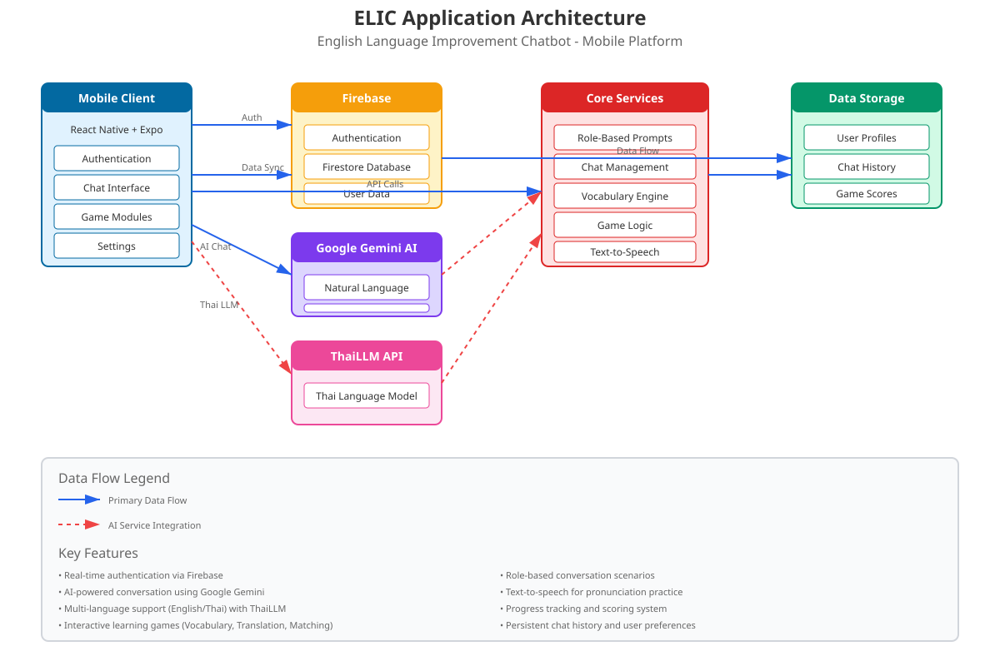

<div align="center">

# ELIC - English Language Improvement Chatbot

### AI-Powered English Learning Mobile Application

[](https://reactnative.dev/)
[](https://expo.dev/)
[](https://firebase.google.com/)
[](https://ai.google.dev/)
[](LICENSE)

[English](#english) | [ไทย](#thai)

</div>

---

<a name="english"></a>

## 📱 About ELIC

**ELIC (English Language Improvement Chatbot)** is an advanced mobile application designed to help users improve their English language skills through interactive AI-powered conversations. Built with React Native and Expo, ELIC leverages cutting-edge artificial intelligence to provide personalized learning experiences.

### 🎬 Demo Video

[](https://youtu.be/PKXDnShNFuY?si=1Jyjcs10awJH5j58)

> Click the image above to watch the demo video on YouTube 🎥

---

## 🏗️ Architecture



The application follows a modern client-server architecture with cloud-based AI services and real-time data synchronization.

### System Components

- **Mobile Client**: React Native + Expo framework providing cross-platform support
- **Firebase Backend**: Authentication, Firestore database, and real-time data sync
- **AI Services**:
  - Google Gemini API for natural language processing
  - ThaiLLM API for Thai language support
- **Core Services**: Role-based prompts, chat management, vocabulary engine, game logic
- **Data Storage**: User profiles, chat history, and game progress

---

## ✨ Key Features

### 🤖 **AI-Powered Conversations**
- Natural language interaction using Google Gemini AI
- Context-aware responses tailored to user proficiency level
- Real-time language correction and feedback
- Automatic detection of Thai language usage (>30% threshold)

### 🎭 **Role-Based Learning**
- Multiple conversation scenarios:
  - Restaurant ordering
  - Job interviews
  - Hotel check-in
  - Business meetings
  - Casual conversations
- Customizable difficulty levels
- Scenario-specific vocabulary and phrases

### 🎮 **Interactive Learning Games**
- **Vocabulary Match**: Pair words with their meanings
- **Translation Challenge**: Translate between English and Thai
- **Word Games**: Spelling and pronunciation exercises
- **Ranking System**: Track progress and compete with others
- **Scoreboard**: View achievements and learning statistics

### 🔊 **Speech Features**
- Text-to-speech for pronunciation practice
- Voice input support (planned)
- Accent selection options

### 💾 **Data Management**
- Persistent chat history
- User preference storage
- Progress tracking across sessions
- Cloud synchronization via Firebase

### 🔐 **Authentication**
- Firebase Authentication
- Google Sign-In integration
- Email/Password registration
- Password recovery system

---

## 📥 Download APK

<div align="center">

### 🚀 Direct Download (Recommended)

[](https://drive.google.com/drive/folders/1_733nt1TTmaK9fqcgd-cGJRLJuieBpj5)

**[📁 View All Downloads on Google Drive](https://drive.google.com/drive/folders/1_733nt1TTmaK9fqcgd-cGJRLJuieBpj5)**

</div>

> **Note**: You need to enable "Install from Unknown Sources" in your Android settings to install the APK.

### Installation Steps

1. **Download the APK**
   - Click the download button above
   - Select the latest APK file from the Google Drive folder
   - Download to your Android device

2. **Install the APK**
   - Open the downloaded APK file
   - If prompted, enable "Install from Unknown Sources"
   - Tap "Install" and wait for completion
   - Open ELIC app

### Build Information
- **Package**: `com.mojo093.Elic`
- **Version**: 1.0.0
- **Build Type**: Release APK
- **Minimum SDK**: Android 5.0 (API 21)
- **Target SDK**: Latest
- **Download Location**: [Google Drive](https://drive.google.com/drive/folders/1_733nt1TTmaK9fqcgd-cGJRLJuieBpj5)

### Alternative: Build Your Own APK

If you prefer to build the APK yourself:

```bash
# Install EAS CLI
npm install -g eas-cli

# Login to Expo
eas login

# Build APK (automated script available)
./build-and-upload.sh

# Or manually:
eas build --platform android --profile preview
```

The automated script `build-and-upload.sh` will:
- Build the APK using EAS
- Automatically upload to Google Drive
- Generate a shareable download link

---

## 🚀 Getting Started

### Prerequisites

- Node.js 18.x or higher
- npm or yarn
- Expo CLI
- Android Studio (for Android development)
- Xcode (for iOS development, macOS only)

### Installation

1. **Clone the repository**
   ```bash
   git clone https://github.com/watcharaponthod-code/elic.git
   cd elic
   ```

2. **Install dependencies**
   ```bash
   npm install
   ```

3. **Configure environment variables**

   Create a `.env` file in the `config/` directory:
   ```env
   GEMINI_API_KEY=your_gemini_api_key
   THAILLM_API_KEY=your_thaillm_api_key
   FIREBASE_API_KEY=your_firebase_api_key
   FIREBASE_AUTH_DOMAIN=your_project.firebaseapp.com
   FIREBASE_PROJECT_ID=your_project_id
   ```

4. **Start the development server**
   ```bash
   npm start
   ```

5. **Run on device/emulator**

   - **Android**: Press `a` or run `npm run android`
   - **iOS**: Press `i` or run `npm run ios`
   - **Web**: Press `w` or run `npm run web`

### Testing with Expo Go

1. Install **Expo Go** from [Google Play](https://play.google.com/store/apps/details?id=host.exp.exponent) or [App Store](https://apps.apple.com/app/expo-go/id982107779)
2. Scan the QR code from the terminal
3. The app will load on your device

---

## 🛠️ Technology Stack

### Frontend
- **React Native** (0.76.9) - Cross-platform mobile framework
- **Expo** (~52.0) - Development platform and tooling
- **React Navigation** (6.x) - Routing and navigation
- **React Native Elements** - UI component library
- **Styled Components** - CSS-in-JS styling

### Backend & Services
- **Firebase** (9.23.0)
  - Authentication
  - Firestore Database
  - Cloud Storage
- **Google Gemini AI** (0.24.1) - Natural language processing
- **Axios** - HTTP client

### AI & Language Processing
- **@google/generative-ai** - Gemini API integration
- **Thai WordCut** - Thai language tokenization

### Additional Libraries
- **Expo AV** - Audio/Video playback
- **Expo Speech** - Text-to-speech
- **Expo Image Picker** - Media selection
- **AsyncStorage** - Local data persistence
- **React Native Flash Message** - Toast notifications

---

## 📂 Project Structure

```
elic/
├── screens/               # Application screens
│   ├── ChatScreen.js     # Main chat interface
│   ├── LoginScreen.js    # User authentication
│   ├── SignUpApp.js      # Registration
│   ├── menu.js           # Main menu/dashboard
│   ├── game/             # Learning game modules
│   │   ├── Match.js      # Vocabulary matching game
│   │   ├── Translation.js # Translation challenges
│   │   ├── WordGame.js   # Word-based games
│   │   ├── Rank.js       # User rankings
│   │   └── Scoreboard.js # Score tracking
│   └── option/           # Settings and configurations
│       ├── Settings.js   # App settings
│       ├── getRolePrompt.js # Role-based prompts
│       └── MiniMenu.js   # Quick access menu
├── components/           # Reusable components
│   └── QuickMessageOptions.js
├── config/              # Configuration files
│   ├── firebase.js      # Firebase configuration
│   └── .env            # Environment variables
├── api/                # API integration
├── assets/             # Images, fonts, icons
├── App.js              # Root component
├── app.json            # Expo configuration
├── package.json        # Dependencies
├── eas.json            # EAS Build configuration
└── architecture-diagram.svg # Architecture diagram
```

---

## 🎯 Key Functionalities

### Chat Management (`ChatScreen.js`)

```javascript
// Example: Generating AI responses
const generateResponse = async (userMessage) => {
  // Detect Thai language usage
  const thaiRatio = detectThaiLanguage(userMessage);

  // Generate context-aware response
  const response = await geminiAPI.generateContent({
    prompt: userMessage,
    context: chatHistory,
    role: currentRole,
    language: thaiRatio > 0.3 ? 'thai' : 'english'
  });

  return response;
};
```

### Role-Based Scenarios (`getRolePrompt.js`)

The app provides contextual conversation starters for various scenarios:

- **Restaurant**: Ordering food, making reservations
- **Interview**: Professional dialogue, Q&A
- **Travel**: Hotel check-in, asking directions
- **Business**: Meeting discussions, presentations
- **Casual**: Everyday conversations

### Game Mechanics

1. **Vocabulary Matching**: Match English words with definitions
2. **Translation**: Convert sentences between languages
3. **Word Games**: Spelling, pronunciation, and grammar challenges
4. **Scoring**: Points awarded for correct answers
5. **Progress Tracking**: View improvement over time

---

## 🔧 Configuration

### Firebase Setup

1. Create a Firebase project at [console.firebase.google.com](https://console.firebase.google.com)
2. Enable Authentication (Email/Password and Google Sign-In)
3. Create a Firestore database
4. Add your Firebase config to `config/.env`

### Google Gemini API

1. Get API key from [Google AI Studio](https://makersuite.google.com/app/apikey)
2. Add to `config/.env`:
   ```env
   GEMINI_API_KEY=your_api_key_here
   ```

### ThaiLLM API

1. Get API key from [thaillm.or.th](http://thaillm.or.th)
2. Configure in your environment:
   ```env
   THAILLM_API_KEY=eF2M1q1WqAciezFxi58qWzXk3GAIngp8
   THAILLM_ENDPOINT=http://thaillm.or.th/api/v1/chat/completions
   ```

---

## 📱 Building for Production

### Android APK

```bash
# Build APK for internal testing
eas build --platform android --profile preview

# Build for production
eas build --platform android --profile production
```

### iOS Build

```bash
# Build for iOS
eas build --platform ios --profile production
```

### OTA Updates

```bash
# Publish updates without rebuilding
eas update --branch production
```

---

## 🤝 Contributing

Contributions are welcome! Please follow these guidelines:

1. Fork the repository
2. Create a feature branch (`git checkout -b feature/AmazingFeature`)
3. Commit your changes (`git commit -m 'Add some AmazingFeature'`)
4. Push to the branch (`git push origin feature/AmazingFeature`)
5. Open a Pull Request

### Development Guidelines

- Follow React Native best practices
- Write clean, commented code
- Test on both Android and iOS
- Update documentation for new features
- Ensure all tests pass before submitting PR

---

## 🐛 Known Issues & Roadmap

### Current Issues
- Voice input feature in development
- iOS build optimization needed
- Offline mode limited functionality

### Upcoming Features
- [ ] Voice-to-text input
- [ ] Offline conversation mode
- [ ] More game varieties
- [ ] Social features (friend challenges)
- [ ] Progress analytics dashboard
- [ ] Multi-language support expansion
- [ ] Dark mode theme

---

## 📄 License

This project is licensed under the MIT License - see the [LICENSE](LICENSE) file for details.

---

## 👨‍💻 Author

**Watcharapon Tosrakza**
Student ID: 6540202949
GitHub: [@watcharaponthod-code](https://github.com/watcharaponthod-code)

---

## 📞 Support

For questions, issues, or suggestions:

- **GitHub Issues**: [Create an issue](https://github.com/watcharaponthod-code/elic/issues)
- **Email**: watcharapon.t@example.com
- **Project Repository**: [github.com/watcharaponthod-code/elic](https://github.com/watcharaponthod-code/elic)

---

## 🙏 Acknowledgments

- Google Gemini AI for natural language processing
- ThaiLLM for Thai language support
- Firebase for backend infrastructure
- Expo team for excellent development tools
- React Native community for continuous support

---

<a name="thai"></a>

# 🇹🇭 ภาษาไทย

## เกี่ยวกับ ELIC

**ELIC (English Language Improvement Chatbot)** เป็นแอปพลิเคชันมือถือที่ใช้ปัญญาประดิษฐ์ขั้นสูงเพื่อช่วยให้ผู้ใช้พัฒนาทักษะภาษาอังกฤษผ่านการสนทนาแบบโต้ตอบ สร้างด้วย React Native และ Expo พร้อมระบบ AI ที่ทันสมัยเพื่อประสบการณ์การเรียนรู้ที่เหมาะกับผู้ใช้แต่ละคน

---

## ✨ คุณสมบัติหลัก

### 🤖 การสนทนาด้วย AI
- ตอบโต้ภาษาธรรมชาติด้วย Google Gemini AI
- คำตอบที่เข้าใจบริบทและปรับให้เหมาะกับระดับความสามารถของผู้ใช้
- แก้ไขภาษาและให้คำติชมแบบเรียลไทม์
- ตรวจจับการใช้ภาษาไทยอัตโนมัติ (มากกว่า 30%)

### 🎭 การเรียนรู้ตามบทบาท
- สถานการณ์การสนทนาหลากหลาย:
  - การสั่งอาหารในร้านอาหาร
  - การสัมภาษณ์งาน
  - การเช็คอินโรงแรม
  - การประชุมธุรกิจ
  - การสนทนาทั่วไป
- ระดับความยากปรับได้
- คำศัพท์และวลีเฉพาะตามสถานการณ์

### 🎮 เกมการเรียนรู้เชิงโต้ตอบ
- **จับคู่คำศัพท์**: จับคู่คำกับความหมาย
- **ท้าทายการแปล**: แปลระหว่างภาษาอังกฤษและไทย
- **เกมคำศัพท์**: ฝึกสะกดคำและออกเสียง
- **ระบบการจัดอันดับ**: ติดตามความก้าวหน้าและแข่งขันกับผู้อื่น
- **กระดานคะแนน**: ดูความสำเร็จและสถิติการเรียนรู้

### 🔊 ฟีเจอร์เสียง
- อ่านข้อความออกเสียงเพื่อฝึกการออกเสียง
- รองรับการป้อนข้อความด้วยเสียง (อยู่ระหว่างพัฒนา)
- เลือกสำเนียงได้

### 💾 การจัดการข้อมูล
- บันทึกประวัติการสนทนา
- เก็บการตั้งค่าผู้ใช้
- ติดตามความก้าวหน้าข้ามเซสชัน
- ซิงค์ข้อมูลผ่าน Cloud ด้วย Firebase

---

## 📥 ดาวน์โหลด APK

<div align="center">

### 🚀 ดาวน์โหลดโดยตรง (แนะนำ)

[](https://drive.google.com/drive/folders/1_733nt1TTmaK9fqcgd-cGJRLJuieBpj5)

**[📁 ดูไฟล์ดาวน์โหลดทั้งหมดบน Google Drive](https://drive.google.com/drive/folders/1_733nt1TTmaK9fqcgd-cGJRLJuieBpj5)**

</div>

> **หมายเหตุ**: คุณต้องเปิดใช้งาน "ติดตั้งจากแหล่งที่ไม่รู้จัก" ในการตั้งค่า Android เพื่อติดตั้ง APK

### ขั้นตอนการติดตั้ง

1. **ดาวน์โหลด APK**
   - คลิกปุ่มดาวน์โหลดด้านบน
   - เลือกไฟล์ APK เวอร์ชันล่าสุดจากโฟลเดอร์ Google Drive
   - ดาวน์โหลดลงในอุปกรณ์ Android ของคุณ

2. **ติดตั้ง APK**
   - เปิดไฟล์ APK ที่ดาวน์โหลดมา
   - หากมีข้อความแจ้ง ให้เปิดใช้งาน "ติดตั้งจากแหล่งที่ไม่รู้จัก"
   - แตะ "ติดตั้ง" และรอจนเสร็จสิ้น
   - เปิดแอพ ELIC

### ทางเลือก: Build APK เอง

หากต้องการ build APK เอง:

```bash
# ติดตั้ง EAS CLI
npm install -g eas-cli

# เข้าสู่ระบบ Expo
eas login

# Build APK (มีสคริปต์อัตโนมัติ)
./build-and-upload.sh

# หรือ build ด้วยตนเอง:
eas build --platform android --profile preview
```

สคริปต์อัตโนมัติ `build-and-upload.sh` จะ:
- Build APK โดยใช้ EAS
- อัพโหลดไปยัง Google Drive อัตโนมัติ
- สร้างลิงก์ดาวน์โหลดแบบแชร์ได้

---

## 🚀 เริ่มต้นใช้งาน

### ความต้องการของระบบ

- Node.js 18.x หรือสูงกว่า
- npm หรือ yarn
- Expo CLI
- Android Studio (สำหรับพัฒนา Android)
- Xcode (สำหรับพัฒนา iOS, macOS เท่านั้น)

### การติดตั้ง

1. **โคลน repository**
   ```bash
   git clone https://github.com/watcharaponthod-code/elic.git
   cd elic
   ```

2. **ติดตั้ง dependencies**
   ```bash
   npm install
   ```

3. **ตั้งค่าตัวแปรสภาพแวดล้อม**

   สร้างไฟล์ `.env` ในโฟลเดอร์ `config/`:
   ```env
   GEMINI_API_KEY=your_gemini_api_key
   THAILLM_API_KEY=your_thaillm_api_key
   FIREBASE_API_KEY=your_firebase_api_key
   ```

4. **เริ่มเซิร์ฟเวอร์พัฒนา**
   ```bash
   npm start
   ```

5. **รันบนอุปกรณ์/โปรแกรมจำลอง**
   - **Android**: กด `a` หรือรัน `npm run android`
   - **iOS**: กด `i` หรือรัน `npm run ios`
   - **Web**: กด `w` หรือรัน `npm run web`

---

## 🛠️ เทคโนโลยีที่ใช้

### Frontend
- **React Native** (0.76.9) - เฟรมเวิร์กพัฒนาแอปข้ามแพลตฟอร์ม
- **Expo** (~52.0) - แพลตฟอร์มและเครื่องมือพัฒนา
- **React Navigation** (6.x) - การนำทางและเราเตอร์
- **React Native Elements** - ไลบรารีคอมโพเนนต์ UI

### Backend และบริการ
- **Firebase** (9.23.0) - Authentication, Firestore, Storage
- **Google Gemini AI** (0.24.1) - ประมวลผลภาษาธรรมชาติ
- **ThaiLLM API** - รองรับภาษาไทย

---

## 📂 โครงสร้างโปรเจกต์

```
elic/
├── screens/              # หน้าจอต่างๆ ของแอพ
│   ├── ChatScreen.js    # หน้าจอแชทหลัก
│   ├── LoginScreen.js   # หน้าล็อกอิน
│   ├── game/            # โมดูลเกมการเรียนรู้
│   └── option/          # การตั้งค่า
├── components/          # คอมโพเนนต์ที่ใช้ซ้ำได้
├── config/             # ไฟล์การตั้งค่า
├── assets/             # รูปภาพ ฟอนต์ ไอคอน
└── App.js              # คอมโพเนนต์หลัก
```

---

## 📄 สัญญาอนุญาต

โปรเจกต์นี้อยู่ภายใต้สัญญาอนุญาต MIT License

---

## 👨‍💻 ผู้พัฒนา

**วัชรพล ถศรักษา**
รหัสนักศึกษา: 6540202949
GitHub: [@watcharaponthod-code](https://github.com/watcharaponthod-code)

---

## 🙏 กิตติกรรมประกาศ

- Google Gemini AI สำหรับการประมวลผลภาษาธรรมชาติ
- ThaiLLM สำหรับการรองรับภาษาไทย
- Firebase สำหรับโครงสร้างพื้นฐานด้านหลัง
- ทีม Expo สำหรับเครื่องมือพัฒนาที่ยอดเยี่ยม
- ชุมชน React Native สำหรับการสนับสนุนอย่างต่อเนื่อง

---

<div align="center">

### ⭐ ถ้าคุณชอบโปรเจกต์นี้ กรุณาให้ดาวบน GitHub!

[](https://github.com/watcharaponthod-code/elic/stargazers)
[](https://github.com/watcharaponthod-code/elic/network/members)

**Made with ❤️ and AI**

</div>